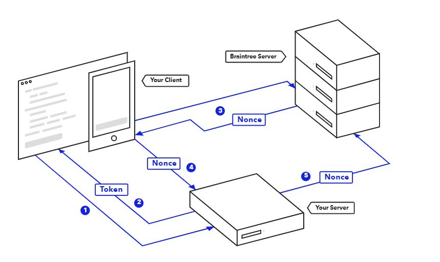
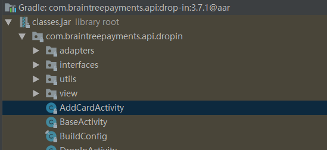
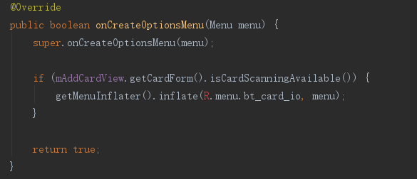
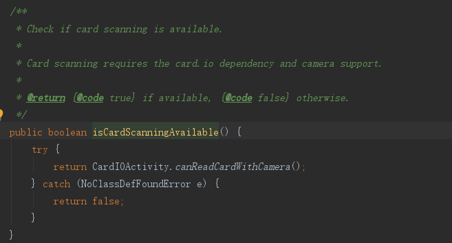
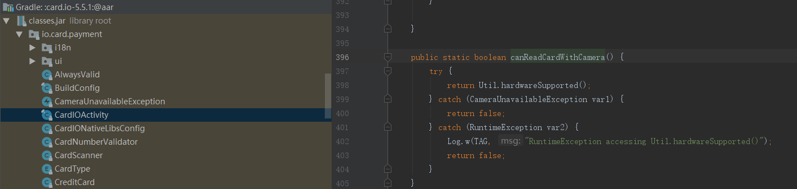

# Android Braintree接入

> Braintree是海外支付整合的公司,支持信用卡,Paypal,Appple pay等支付方式

[TOC]


## Braintree SDK相关支持

#### 官网

https://developers.braintreepayments.com/start/overview

#### Client SDK

* Android
* iOS
* JS

#### Drop-in UI


#### Sandbox

* 可以在官网注册sandbox账号,模拟测试


## Braintree 运作流程



1. client端向己方服务器请求clientToken
2. 己方服务器使用server sdk生成token后返回给client端
3. 用户使用braintree生成支付信息后,通过braintree sdk发送给braintree服务器; braintree服务器会返回支付nonce
4. client端将支付nonce发送给己方服务器
5. 己方服务器收到nonce后使用server sdk到braintree服务器创建交易


## Braintree SDK版本选择

> Android SDK目前有两个版本, v3和v2

* V3  -- 要求Android API >= 21
* V2 -- 要求Android API >= 16

考虑minSDK版本的兼容性,选择**v2**


## Android Studio配置方式


#### Braintree SDK

In `build.gradle`

```
dependencies {
  ......
  compile 'com.braintreepayments.api:braintree:2.22.0'
  
}
```


支持PayPal网页支付配置, In `AndroidMainfest.xml`

```
<activity android:name="com.braintreepayments.api.BraintreeBrowserSwitchActivity"
    android:launchMode="singleTask">
    <intent-filter>
        <action android:name="android.intent.action.VIEW" />
        <category android:name="android.intent.category.DEFAULT" />
        <category android:name="android.intent.category.BROWSABLE" />
        <data android:scheme="${applicationId}.braintree" />
    </intent-filter>
</activity>
```


#### Drop-in UI

> 提供快速整合支付方式的UI模块,   并且支持自定义


In `build.gradle`

```
compile 'com.braintreepayments.api:drop-in:3.7.1'
```


## 使用方式

> 我们使用braintree只要支持的支付方式是paypal和credit card,所以直接使用Drop-in UI即可


#### Present Drop-in UI

```
//使用ClientToken换气Drop-in UI
public void onBraintreeSubmit(String clientToken) {
  DropInRequest dropInRequest = new DropInRequest()
    .clientToken("xxxx");
  startActivityForResult(dropInRequest.getIntent(this), REQUEST_CODE);
}
```


#### Receive PaymentMethodNonece

```
@Override
protected void onActivityResult(int requestCode, int resultCode, Intent data) {
  if (requestCode == REQUEST_CODE) {
    if (resultCode == RESULT_OK) {
      DropInResult result = data.getParcelableExtra(DropInResult.EXTRA_DROP_IN_RESULT);
      // use the result to update your UI and send the payment method nonce to your server
    } else if (resultCode == RESULT_CANCELED) {
      // the user canceled
    } else {
      // handle errors here, an exception may be available in
      Exception error = (Exception) data.getSerializableExtra(DropInActivity.EXTRA_ERROR);
    }
  }
}
```


## 如何支持信用卡扫描识别

按照上述流程,点击credit card后显示的DropIn-UI页面只有纯文本输入卡号页面,没有扫描credit card功能,这是为什么呢?

#### 来一起看drop-in源码.

1. 找到添加credit card页面 -- 在drop-in的sdk中




2. 查看控制扫卡添加的按钮方法 -- onCreateOptionsMenu

   

3. 查看isCardScanningAvailable方法

   

4. 原来是使用了CardIOActivity类,该类是card.io(扫描信用卡第三方模块)的页面,所以我们就需要导入card.io

   


#### 添加Card.io依赖

1. 下载card.io.aar -- 这里我们下载5.5.1版本 https://github.com/card-io/card.io-Android-SDK/tree/master/aars

2. 放入项目的aars文件夹中(如没有则在主目录下新建)

3. In `build.gradle`

   ```
   repositories {
       flatDir {
           dirs 'aars'
       }
   }
   
   dependencies {
   	......
   	compile(name:'card.io-5.5.1', ext:'aar')
   }
   ```

4. In `AndroidManifest.xml`

   ```
   <activity
       android:name="io.card.payment.CardIOActivity"
   	android:configChanges="keyboardHidden|orientation" />
   ```

5. 运行,ok!


## More

#### DropInRequest

* DropInRequest可以开启关闭多种支付方式
* 在使用DropInRequest可以设置vaultManager(boolean),如果设置true,用户可以主动删除记录的支付方式 -- 如果是订阅支付请不要提供该功能,因为可以是用户主动删除用户的支付信息,导致订阅失效

